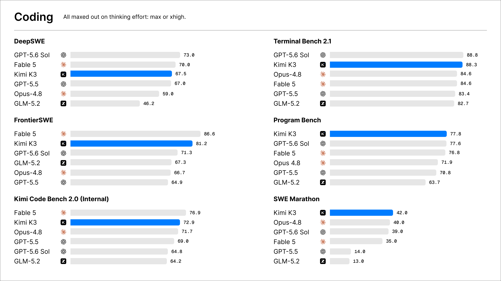
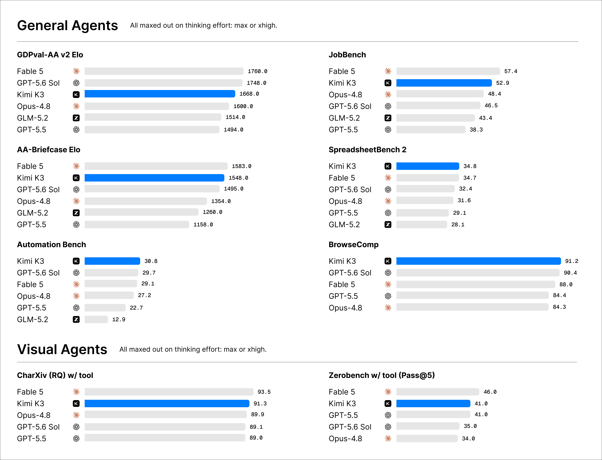
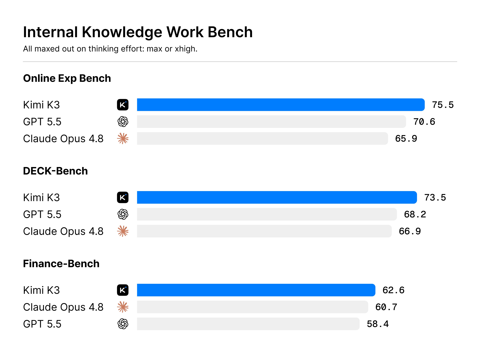

# Kimi K3 Swarm Workstation

## The world's largest open AI model — 2.8 trillion parameters — now commands a 300-agent hive on your desktop.

Moonshot just shipped **Kimi K3**: 2.8T parameters, a 1-million-token context window, native vision, and the new **K3 Swarm Max** orchestrator built specifically to run armies of sub-agents. We wrapped it into a native desktop command center. Describe a goal, and up to 300 K3 sub-agents fan out in parallel — researching, coding, scraping, analyzing, and seeing — finishing in minutes what a single model grinds through in hours.

This is the largest open-weight model ever released, ranked **#1 in the world for web-interface building** and beating Claude Opus 4.8 and GPT-5.5 across Moonshot's evaluation suite. Now it works as a swarm, on your machine, one click away.

  

> ### 🎁 Launch offers (limited)
> - **First 1,000 users get the Swarm tier free for life.** Registration closes at 1,000 — after that it's gone.
> - **+50% bonus credits** on any top-up through August 11, via our launch pool.
> - **Refer a friend, get +300 agents** added to your personal swarm cap — stack it as high as your network goes.
> - **Founding early-access:** our users are first in line for the July 27 open-weights drop and the local build.

   

---

## Why 2.8 trillion parameters changes the swarm game

Every prior swarm tool was bottlenecked by the model driving it. Kimi K3 removes that ceiling:

- **2.8T parameters, the largest open model on Earth** — 75% bigger than DeepSeek V4 Pro, and it shows in reasoning depth per agent.
- **Kimi Delta Attention (KDA)** — a hybrid linear-attention design that decodes up to **6.3× faster at million-token context**. In swarm terms: 300 agents that don't choke on long context.
- **Native vision, built in** — every agent can see. Screenshots, charts, competitor UIs, diagrams — analyzed inline, no bolt-on vision model.
- **Ranked #1 for web-interface building**, and ahead of Claude Opus 4.8 and GPT-5.5 across Moonshot's suite — the swarm inherits frontier-class quality on every node.
- **1M-token context per agent** — each sub-agent holds an entire codebase or document set without losing the thread.
## Meet the hive

Dispatch a goal; the Swarm Orchestrator (powered by K3 Swarm Max) breaks it into parallel work and assigns specialists:

**🕸 Hyper-Parallel Browser** — 300 agents crawl the web at once, each in an isolated context, gathering from Amazon, Reddit, LinkedIn, and GitHub simultaneously without tripping anti-fraud systems.

**🐝 MCP Hive** — every agent carries a full MCP toolset (files, browser, databases, APIs). Kimi K3 is elite at tool use; the Hive multiplies that across the whole swarm.

**🌉 Swarm Bridge** — K3 exposes an Anthropic/OpenAI-compatible API, so the Workstation drops straight into Claude Code, Cursor, or OpenClaw as a backend. Same swarm power, a fraction of frontier API cost.

**👁 Swarm Vision** — with K3's native vision, all 300 agents see. Compare 50 competitor interfaces in a single pass.

**🧠 ThoughtStream** — K3 runs an always-on thinking mode, so we render it live. Watch every agent reason in real time; click any one to see the page it's reading or the line it's editing.

**📂 Data Fusion Engine** — the hive's findings auto-compile into finished PDF, Excel, and JSON reports, with proofs and links attached.

**⚙️ Custom Agent Tuning** — assign roles: "50 agents hunt negative reviews, 50 track pricing, 200 write code." Plus our **PARL** coordination layer, which keeps agents in synergy instead of colliding, and **Critical-Steps routing**, which floods compute to the hard parts and cuts runtime up to 80%.

## Where the swarm earns its keep

| Field | What the hive does | What you get back |
|---|---|---|
| Development | 300 agents sweep the whole repo for bugs in parallel | Clean build before deploy |
| Frontend | K3's #1 web-building skill, parallelized across agents | Full UI generated and reviewed in minutes |
| Research | Hundreds of sources scanned and cross-checked at once | A sourced 50-page brief |
| Marketing | 100+ competitor campaigns analyzed simultaneously | A complete strategy in minutes |
| Investing | Financials of 50 companies pulled in parallel | One decision-ready comparison table |
| Agent backend | Drive Claude Code / Cursor through the Bridge | Frontier-class agents, far cheaper |

## How it compares

Single-agent tools — even the strongest — think in one line at a time. The Workstation thinks in 300. Against a lone GPT-5.5 or Claude Opus 4.8 session, K3 Swarm runs up to 1,500+ tool calls to their 50–100, executes on native OS (real EXE/DMG, not a browser tab), and drives cost toward zero through the free proxy layer. And because K3 is itself the largest open model in the world — #1 at web building, ahead of Opus 4.8 and GPT-5.5 on Moonshot's suite — you're not trading quality for parallelism. You get both.

## Install

Skip the terminal. [View all releases](../../releases)

- **Windows** → `Kimi-K3-Swarm-x64.exe`, double-click. RTX 30xx+ helps but isn't required.
- **Mac** → `Kimi-K3-Swarm.dmg`, drag to Applications. Native M1–M5.
Signed, notarized, SHA-256 checksums on every release. Your free-for-life Swarm tier activates on first launch if you're in the first 1,000.

## Benchmarks

## Questions

**Is it really free?** The app is free, and Swarm mode runs through our proxy pool — most users never pay. First 1,000 registrants keep the Swarm tier free for life. Beyond that, add your own Moonshot key (with +50% bonus credits through August 11).

**Can my computer handle 300 agents?** Yes — orchestration is the only local work; K3 runs in the cloud. 8GB RAM is plenty. When open weights drop July 27, founding users get first access to the local build.

**Is the EXE/DMG safe?** Sandboxed, signed, checksummed, isolated local browser engine so task data isn't retained on Moonshot's servers. Source on GitHub.

**How is K3 different?** It's the largest open model ever — 2.8T parameters, 1M context, native vision, Kimi Delta Attention for 6.3× faster long-context decoding. In a swarm, every one of those advantages multiplies by 300.

**What's the referral thing?** Refer a friend, both of you get +300 to your swarm agent cap. Stack it as high as you want.

---

*Built on Moonshot AI's Kimi K3 (open weights releasing July 27, 2026). Independent third-party desktop app — not affiliated with, endorsed by, or operated by Moonshot AI. "Kimi," "Claude," "Opus," "GPT," "Cursor," "OpenClaw," and "MCP" identify technologies this app integrates with or compares to (nominative fair use). Launch offers are provided by this project and subject to availability. Benchmark and performance figures reflect Moonshot's reported July 2026 results and typical configurations; real-world results vary. MIT-licensed client — see [LICENSE](LICENSE).*

Claim one of the first 1,000 lifetime Swarm seats — and if the hive delivered, leave a ⭐.
